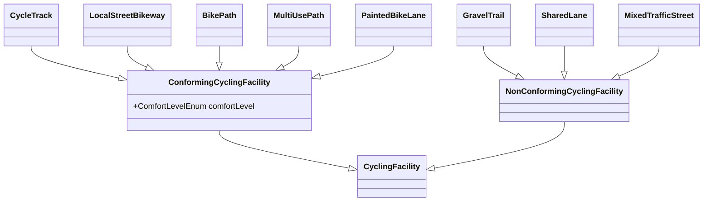

# CanBICSOntology

Ontology for the [Can-BICS](https://chatrlab.ca/projects/can-bics-english/) classification. Expands on [schema.org](https://schema.org/). 

## Class Diagram

```mermaid

classDiagram
    CyclingFacility

    class ConformingCyclingFacility {
      +ComfortLevelEnum comfortLevel 
    }

    ConformingCyclingFacility --|> CyclingFacility
    NonConformingCyclingFacility --|> CyclingFacility
    CycleTrack --|> ConformingCyclingFacility
    LocalStreetBikeway --|> ConformingCyclingFacility
    BikePath --|> ConformingCyclingFacility
    MultiUsePath --|> ConformingCyclingFacility
    PaintedBikeLane --|> ConformingCyclingFacility
    GravelTrail --|> NonConformingCyclingFacility 
    SharedLane --|> NonConformingCyclingFacility
    MixedTrafficStreet --|> NonConformingCyclingFacility


```
