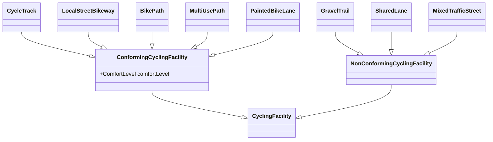

# CanBICSOntology

Ontology for the [Can-BICS](https://chatrlab.ca/projects/can-bics-english/) classification. Expands on [schema.org](https://schema.org/). 

## Class Diagram

Start browsing from the base class: [CyclingFacility](CyclingFacility)

## Reference

- [Canadian Bikeway Comfort and Safety (Can-BICS) classification system ](https://chatrlab.ca/projects/can-bics-english/)
- [Système de classification du confort et de la sécurité des voies cyclables canadiennes (Can-BICS)](https://chatrlab.ca/projects/can-bics-english/can-bics-francais/)
- [At-a-glance – The Canadian Bikeway Comfort and Safety (Can-BICS) Classification System: a common naming convention for cycling infrastructure](https://www.canada.ca/en/public-health/services/reports-publications/health-promotion-chronic-disease-prevention-canada-research-policy-practice/vol-40-no-9-2020/canbics-classification-system-naming-convention-cycling-infrastructure.html)
- [Aperçu – Système de classification du confort et de la sécurité des voies cyclables canadiennes (Can-BICS) : convention d’appellation commune des aménagements cyclables](https://www.canada.ca/fr/sante-publique/services/rapports-publications/promotion-sante-prevention-maladies-chroniques-canada-recherche-politiques-pratiques/vol-40-no-9-2020/systeme-classification-canbics-convention-appellation-amenagements-cyclables.html)